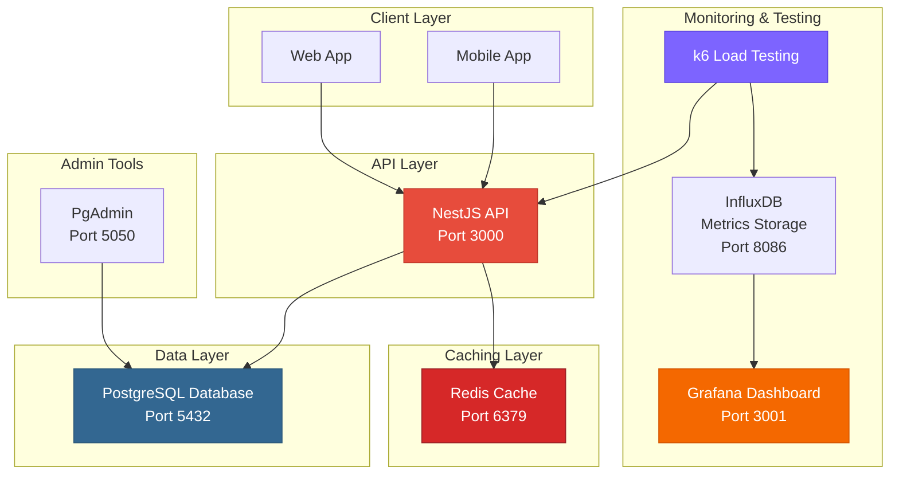
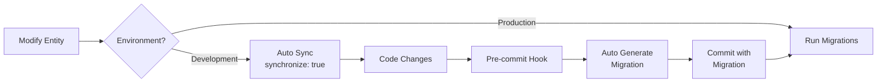

<p align="center">
  <a href="http://nestjs.com/" target="blank"></a>
</p>

# 🏋️ Gym Tracker API

A high-performance, production-ready backend service for the Gym Tracker application. Built with [NestJS](https://github.com/nestjs/nest), PostgreSQL, Redis, and comprehensive performance monitoring.

## 📚 Table of Contents

- [Architecture Overview](#-architecture-overview)
- [Tech Stack](#-tech-stack)
- [Prerequisites](#-prerequisites)
- [Quick Start](#-quick-start)
- [Configuration](#️-configuration)
- [Services & Components](#-services--components)
- [Performance Testing](#-performance-testing)
- [Database Migrations](#️-database-migrations)
- [Monitoring & Observability](#-monitoring--observability)
- [Production Deployment](#-production-deployment)
- [Testing](#-testing)

## 🏗️ Architecture Overview

This application follows a modern microservices-ready architecture with built-in caching, performance monitoring, and load testing capabilities.



## 🛠️ Tech Stack

### Core Framework

- **[NestJS](https://nestjs.com/)** v11 - Progressive Node.js framework
- **[TypeScript](https://www.typescriptlang.org/)** v5.7 - Type-safe JavaScript
- **[TypeORM](https://typeorm.io/)** v0.3 - ORM for database management

### Database & Caching

- **[PostgreSQL](https://www.postgresql.org/)** v15 - Primary relational database
- **[Redis](https://redis.io/)** v7 - In-memory caching layer

### Performance & Monitoring

- **[k6](https://k6.io/)** - Load testing and performance benchmarking
- **[InfluxDB](https://www.influxdata.com/)** v1.8 - Time-series metrics database
- **[Grafana](https://grafana.com/)** - Metrics visualization and dashboards

### Authentication & Security

- **JWT** - Token-based authentication
- **Passport** - Authentication middleware
- **bcrypt** - Password hashing

### Additional Tools

- **[PgAdmin](https://www.pgadmin.org/)** - Database administration UI
- **Docker & Docker Compose** - Containerization and orchestration

## 📋 Prerequisites

- **Node.js** v18 or higher
- **Docker** & **Docker Compose** (Recommended)
- **PostgreSQL** v15+ (if running locally without Docker)
- **Redis** v7+ (if running locally without Docker)

## 🚀 Quick Start

### Using Docker (Recommended)

1. **Clone the repository**

   ```bash
   git clone <repository-url>
   cd api-gym-tracker
   ```

2. **Create environment file**

   ```bash
   cp .env.example .env
   # Edit .env with your configuration
   ```

3. **Start all services**

   ```bash
   docker compose up --build
   ```

4. **Access the services**
   - **API**: http://localhost:3000/api
   - **PgAdmin**: http://localhost:5050 (admin@admin.com / admin)
   - **API Documentation**: http://localhost:3000/api/docs (if Swagger is enabled)

### Running Locally (Without Docker)

1. **Install dependencies**

   ```bash
   npm install
   ```

2. **Start PostgreSQL and Redis**

   ```bash
   # Ensure PostgreSQL is running on port 5432
   # Ensure Redis is running on port 6379
   ```

3. **Run migrations**

   ```bash
   npm run migration:run
   ```

4. **Start the application**

   ```bash
   # Development mode with hot-reload
   npm run start:dev

   # Production mode
   npm run start:prod
   ```

## ⚙️ Configuration

Create a `.env` file in the root directory with the following variables:

```env
# Server Configuration
PORT=3000
NODE_ENV=development

# Database Configuration
DATABASE_HOST=postgres          # Use 'localhost' if running locally
DATABASE_PORT=5432
DATABASE_USER=postgres
DATABASE_PASSWORD=postgres
DATABASE_NAME=gym_db

# JWT & Security
JWT_SECRET=your_super_secret_key_change_in_production
JWT_EXPIRATION=7d

# External APIs
GEMINI_API_KEY=your_gemini_api_key
CLOUDINARY_CLOUD_NAME=your_cloudinary_name
CLOUDINARY_API_KEY=your_cloudinary_key
CLOUDINARY_API_SECRET=your_cloudinary_secret

# Redis Configuration (Optional - defaults shown)
REDIS_HOST=redis               # Use 'localhost' if running locally
REDIS_PORT=6379
```

## 🧩 Services & Components

### Core Services

#### 1. **API Service** (NestJS)

- RESTful API endpoints
- JWT-based authentication
- Request validation and transformation
- Error handling and logging
- Hot module replacement (HMR) in development

**Resource Limits:**

- CPU: 2 cores (max), 0.5 cores (reserved)
- Memory: 2GB (max), 512MB (reserved)

#### 2. **PostgreSQL Database**

- Primary data storage
- Optimized connection pooling (max: 100, min: 20)
- Query performance logging (queries >100ms)
- Automatic backups via Docker volumes

**Performance Tuning:**

```yaml
max_connections: 200
shared_buffers: 256MB
log_min_duration_statement: 100ms
```

#### 3. **Redis Cache**

- In-memory caching for frequently accessed data
- Cache-aside pattern implementation
- LRU eviction policy
- 256MB memory limit

**Cached Endpoints:**

- `GET /exercises` - 10 minutes TTL
- `GET /exercises/equipment/all` - 10 minutes TTL
- `GET /exercises/muscles/all` - 10 minutes TTL
- `GET /routines/stats/global` - 1 minute TTL

#### 4. **PgAdmin**

- Web-based database administration
- Query editor and visual schema designer
- Database monitoring and statistics

**Default Credentials:**

- Email: `admin@admin.com`
- Password: `admin`

### Performance Testing Stack

#### 5. **k6 Load Testing**

- Automated performance testing
- Multiple test scenarios (smoke, load, stress, spike)
- Custom metrics and thresholds
- Real-time performance feedback

**Available Test Scripts:**

- `smoke-test.js` - Minimal load verification
- `load-test.js` - Normal load simulation
- `stress-test.js` - Breaking point identification
- `spike-test.js` - Sudden traffic surge testing

#### 6. **InfluxDB**

- Time-series database for metrics
- Stores k6 test results
- High-performance write operations
- Unlimited HTTP body size for large payloads

#### 7. **Grafana**

- Real-time metrics visualization
- Pre-configured k6 dashboards
- Anonymous access enabled (for development)
- Custom dashboard provisioning

## 🧪 Performance Testing

### Running Load Tests

The testing stack uses Docker profiles to keep testing services separate from development.

```bash
# Start the testing stack (k6 + InfluxDB + Grafana)
docker compose --profile testing up

# Run specific test scenarios
docker compose --profile testing up k6  # Uses default test (stress-test.js)

# Run custom test
docker compose run --rm k6 run /scripts/load-test.js
docker compose run --rm k6 run /scripts/smoke-test.js
docker compose run --rm k6 run /scripts/spike-test.js
```

### Test Scenarios

#### 🔹 Smoke Test

**Purpose:** Verify system works with minimal load

```javascript
Stages:
- 1 VU for 30 seconds

Thresholds:
- 95% of requests < 500ms
- < 1% error rate
```

#### 🔹 Load Test

**Purpose:** Simulate normal production load

```javascript
Stages:
- Ramp up to 20 VUs in 30s
- Stay at 20 VUs for 1 minute
- Ramp down to 0 in 10s

Thresholds:
- 95% of requests < 500ms
- < 5% error rate
```

#### 🔹 Stress Test

**Purpose:** Find system breaking point

```javascript
Stages:
- Ramp up to 100 VUs in 2 minutes
- Stay at 100 VUs for 5 minutes
- Ramp up to 200 VUs in 2 minutes
- Stay at 200 VUs for 5 minutes
- Ramp down to 0 in 2 minutes

Thresholds:
- 95% of requests < 1000ms
- < 10% error rate
```

#### 🔹 Spike Test

**Purpose:** Test sudden traffic surge handling

```javascript
Stages:
- Start with 10 VUs for 1 minute
- Spike to 100 VUs in 10 seconds
- Stay at 100 VUs for 1 minute
- Drop to 10 VUs in 10 seconds
- Stay at 10 VUs for 1 minute

Thresholds:
- 95% of requests < 2000ms
- < 15% error rate
```

### Viewing Test Results

1. **Start Grafana**

   ```bash
   docker compose --profile testing up grafana
   ```

2. **Access Dashboard**
   - URL: http://localhost:3001
   - Pre-configured k6 dashboard available
   - Real-time metrics during test execution

3. **Key Metrics to Monitor**
   - Request rate (requests/second)
   - Response time (p95, p99)
   - Error rate
   - Virtual users (VUs)
   - Data transfer rates

## 🗄️ Database Migrations

This project uses an **automated migration system** combining development speed with production safety.

### How It Works



### Development Workflow

**Automatic Schema Sync:**

```bash
# 1. Start Docker
docker compose up

# 2. Modify your entities (e.g., add a column)
# Example: src/entities/user.entity.ts

# 3. Database updates automatically - no action needed! ✅
```

**Before Committing:**

```bash
# Pre-commit hook automatically:
# 1. Detects entity changes
# 2. Generates migration if needed
# 3. Adds migration to your commit

git add .
git commit -m "Added new field to User entity"
# Migration auto-generated and included! ✅
```

### Manual Migration Commands

```bash
# Check if migrations are needed
npm run migration:check

# Generate a migration manually
npm run migration:generate -- src/migrations/MigrationName

# Run pending migrations
npm run migration:run

# Revert last migration
npm run migration:revert
```

### Important Notes

- ✅ **Development**: `synchronize: true` - automatic schema updates
- ✅ **Production**: `synchronize: false` - migrations only
- ✅ **Pre-commit hook**: Auto-generates migrations for `.entity.ts` changes
- ⚠️ **Never** manually edit generated migrations unless necessary

## 📊 Monitoring & Observability

### Application Logging

The application includes comprehensive logging:

```typescript
// Query performance logging
- Logs queries taking > 100ms
- Logs slow queries in development
- Error-only logging in production

// Connection pool monitoring
- Max connections: 200
- Shared buffers: 256MB
- Connection timeout: 10s
```

### Redis Monitoring

```bash
# Connect to Redis CLI
docker compose exec redis redis-cli

# Monitor cache hit/miss ratio
INFO stats

# View cached keys
KEYS *

# Check memory usage
INFO memory
```

### Database Monitoring

**Via PgAdmin:**

1. Access http://localhost:5050
2. Login with admin credentials
3. Navigate to Dashboard → Statistics

**Via CLI:**

```bash
# Connect to PostgreSQL
docker compose exec postgres psql -U postgres -d gym_db

# View active connections
SELECT * FROM pg_stat_activity;

# View table sizes
SELECT schemaname, tablename, pg_size_pretty(pg_total_relation_size(schemaname||'.'||tablename))
FROM pg_tables
WHERE schemaname = 'public'
ORDER BY pg_total_relation_size(schemaname||'.'||tablename) DESC;
```

## 🚢 Production Deployment

### Docker Build

```bash
# Build production image
docker build -t gym-tracker-api:latest .

# Run container
docker run -d \
  -p 3000:3000 \
  --env-file .env.production \
  --name gym-api \
  gym-tracker-api:latest
```

### Pre-Deployment Checklist

- [ ] Update `.env` with production values
- [ ] Set `NODE_ENV=production`
- [ ] Use strong `JWT_SECRET`
- [ ] Configure production database credentials
- [ ] Set up SSL/TLS certificates
- [ ] Configure CORS for production domains
- [ ] Run migrations: `npm run migration:run`
- [ ] Set up database backups
- [ ] Configure Redis persistence (if needed)
- [ ] Set up monitoring and alerting
- [ ] Review and adjust resource limits
- [ ] Enable rate limiting
- [ ] Configure logging aggregation

### Environment-Specific Settings

**Production:**

```env
NODE_ENV=production
DATABASE_HOST=<production-db-host>
REDIS_HOST=<production-redis-host>
JWT_SECRET=<strong-random-secret>
```

**Staging:**

```env
NODE_ENV=staging
DATABASE_HOST=<staging-db-host>
REDIS_HOST=<staging-redis-host>
```

### Running Migrations in Production

```bash
# Via Docker
docker exec -it <container_id> npm run migration:run

# Via npm (if running directly)
npm run migration:run
```

## 🧪 Testing

### Unit Tests

```bash
# Run all unit tests
npm run test

# Run tests in watch mode
npm run test:watch

# Generate coverage report
npm run test:cov
```

### E2E Tests

```bash
# Run end-to-end tests
npm run test:e2e
```

### Load Tests

See [Performance Testing](#-performance-testing) section above.

## 📁 Project Structure

```
api-gym-tracker/
├── src/
│   ├── app/
│   │   ├── modules/          # Feature modules
│   │   │   ├── auth/         # Authentication
│   │   │   ├── exercises/    # Exercise management
│   │   │   ├── nutrition/    # Nutrition tracking
│   │   │   └── routine/      # Workout routines
│   │   ├── controllers/      # HTTP controllers
│   │   └── services/         # Business logic
│   ├── entities/             # TypeORM entities
│   ├── migrations/           # Database migrations
│   └── main.ts              # Application entry point
├── tests/                    # k6 load tests
│   ├── smoke-test.js
│   ├── load-test.js
│   ├── stress-test.js
│   └── spike-test.js
├── grafana/                  # Grafana configuration
│   ├── dashboards/          # Dashboard definitions
│   └── datasources/         # Data source configs
├── scripts/                  # Utility scripts
├── docker-compose.yml       # Docker orchestration
├── Dockerfile              # Container definition
└── README.md              # This file
```

## 🔧 Troubleshooting

### Common Issues

**Database Connection Failed**

```bash
# Check if PostgreSQL is running
docker compose ps postgres

# View PostgreSQL logs
docker compose logs postgres

# Restart PostgreSQL
docker compose restart postgres
```

**Redis Connection Failed**

```bash
# Check if Redis is running
docker compose ps redis

# Test Redis connection
docker compose exec redis redis-cli ping
# Should return: PONG
```

**API Not Starting**

```bash
# View API logs
docker compose logs api -f

# Rebuild API container
docker compose up --build api
```

**Migration Errors**

```bash
# Check migration status
npm run migration:check

# Revert last migration
npm run migration:revert

# Re-run migrations
npm run migration:run
```

## 📝 License

This project is [UNLICENSED](LICENSE).

## 👥 Contributing

1. Fork the repository
2. Create your feature branch (`git checkout -b feature/amazing-feature`)
3. Commit your changes (`git commit -m 'Add some amazing feature'`)
4. Push to the branch (`git push origin feature/amazing-feature`)
5. Open a Pull Request

## 📧 Support

For issues and questions, please open an issue in the repository.

---

Built with ❤️ using [NestJS](https://nestjs.com/)
